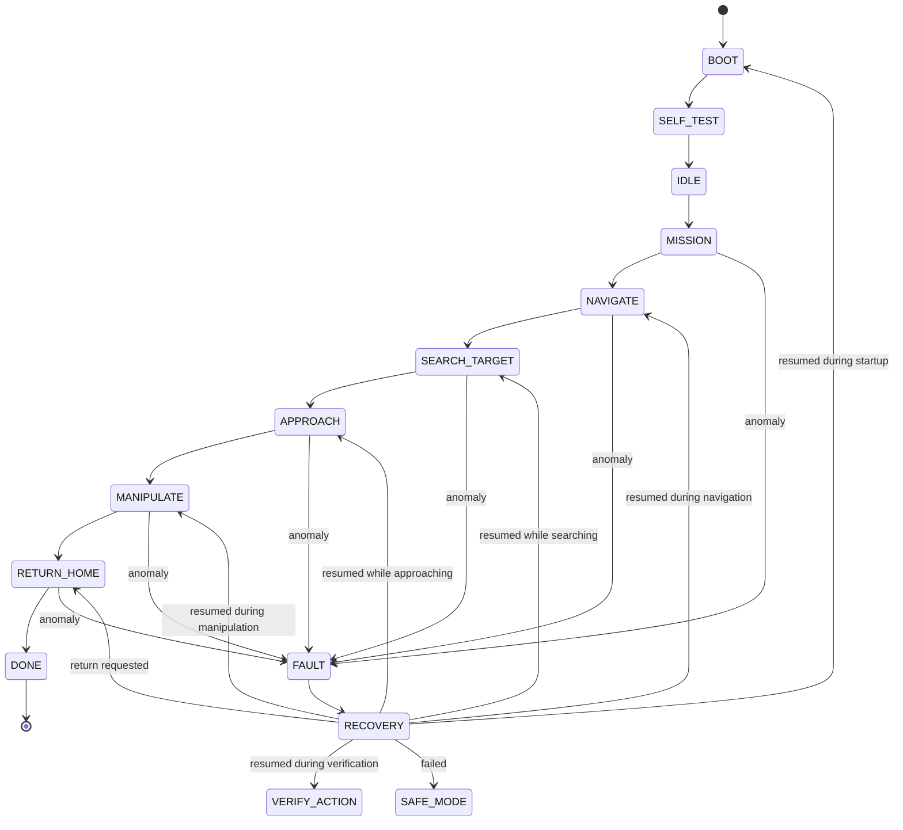

# 🚀🤖 Autonomous Rover — Onboard Navigation, Perception &amp; Fault Recovery

> An autonomous inspection rover on Raspberry Pi, engineered as a **mini systems engineering project**:  
> requirements → architecture → implementation → verification → fault injection → recovery.
>
> *Selected space software engineering practices inspired by ECSS, applied to a small autonomous robotic platform.*

## 🎯 Mission

A *planetary rover*–style inspection scenario for a controlled course:

1. Self-test at startup
2. Autonomous navigation to a zone of interest (obstacle avoidance)
3. Target detection and identification with the onboard camera
4. Approach / alignment, then arm action (touch, grasp, press)
5. Action verification, then `RETURN HOME`
6. Periodic health checks and fault response: recover, request return, or enter `SAFE MODE`

## 🔀 State Machine

The mission manager enforces explicit, validated state transitions. A fault enters `FAULT → RECOVERY`, then resumes the interrupted state, requests return, or enters `SAFE_MODE`.



The FDIR health manager tracks:

`NOMINAL → DEGRADED → CRITICAL → SAFE`

## 🏗️ Architecture

```text
src/
├── mission/        # which activity to perform (Mission Manager)
├── navigation/     # where to go, how to avoid, when to stop
├── perception/     # image → target/obstacle → relative position
├── manipulation/   # timed arm/gripper sequence and visual verification
├── fdir/           # fault detection, isolation & recovery
├── hardware/       # camera, motors, arm, sensors, battery
└── common/         # event logging, state transitions, utilities
```

Key separation: **decision (mission) / behavior (navigation, perception) / control**, with FDIR able to interrupt a nominal activity as soon as a critical condition is detected.

## 🔌 Hardware Abstraction

Navigation and mission logic use an injected robot interface for motion, camera, and optional battery telemetry:

```python
robot.move(v, omega)
robot.stop()
robot.get_camera_frame()
robot.get_battery()
```

`RealRobot` adapts the Adeept `Move` driver and the local Picamera2 wrapper. The ultrasonic adapter uses Adeept's `Ultra.checkdist()` (centimeters) and exposes meters to navigation. The arm adapter uses servo channels 2 and 4 via `RPIservo.ServoCtrl`; verify these channel assignments and servo directions on the assembled robot before running the mission. Hardware dependencies are injected in the tests.

> No ROS required: a modular Python architecture, designed to stay simple and verifiable.

## 🧭 Mission Behavior

Run on the Raspberry Pi from the repository root:

```bash
python -m src.mission.mission_manager
```

The mission performs a camera/range/servo-state self-test; searches for the configured color target; aligns and approaches using its estimated range; runs a timed open/lower/grip/lift sequence; checks that the target is no longer visible; then replays recorded motion segments in reverse as a best-effort return.

## 🛡️ FDIR

- Periodic CPU, memory, and temperature checks using Adeept's `Info` module; battery monitoring runs only when a battery reader is configured.
- Camera and ultrasonic failures are retried once and verified. A failed recovery or critical fault stops the drive and servo motion and latches `SAFE_MODE`.
- Low battery requests return; a critical battery reading requests SAFE.
- Fault injection is available from the mission entry point:

```bash
python -m src.mission.mission_manager --fault camera
python -m src.mission.mission_manager --fault motor
python -m src.mission.mission_manager --fault battery
python -m src.mission.mission_manager --fault communication
```

Motor and communication faults are injected scenarios because the current hardware interface has no motor feedback or communication-health signal. Battery fault injection is also independent of a physical battery reading.

## ✅ Verification

Run the hardware-independent unit and mission tests:

```bash
python -m unittest discover -s tests -p "test_*.py"
```

The tests cover state transitions, the nominal mission path, return replay, arm driver commands, recovery, fault injection, and safe-state behavior using fake devices. They do not verify physical movement, grasp success, camera calibration, or return-home accuracy.

V&amp;V  artifacts: [requirements](docs/requirements.md), [verification matrix](docs/verification_matrix.md), [test report](docs/test_report.md), [metrics](docs/metrics.md), [architecture](docs/architecture.md), [FDIR](docs/fdir.md), and [limitations](docs/limitations.md). Matrix statuses distinguish software evidence from hardware checks not yet run.

## ⚠️ Limitations

- Return-home is reverse replay of timed commands, not localization. Wheel slip, collisions, or changed obstacles can prevent reaching the start.
- Manipulation is open-loop servo timing. Verification only checks target visibility; it does not prove the object was grasped or moved.
- The arm adapter assumes Adeept servo channels 2 (arm) and 4 (gripper), with stock directions and a 0.4-second movement pulse. Calibrate before hardware execution.
- There is no wheel odometry, measured motor response, physical battery percentage, or communication monitor. A servo self-test reads the driver's tracked position, not physical feedback.
- The navigation policy is local and reactive, using one forward-facing ultrasonic sensor. It does not plan around arbitrary obstacles.

## ✅ Engineering Approach

This is **not** ECSS-compliant space software — it is a project that **applies practices inspired by ECSS-E-ST-40** (requirements, design, V&amp;V, traceability) to a small autonomous robotic platform. The goal: demonstrate the *systems engineering* reasoning behind a real autonomous system.