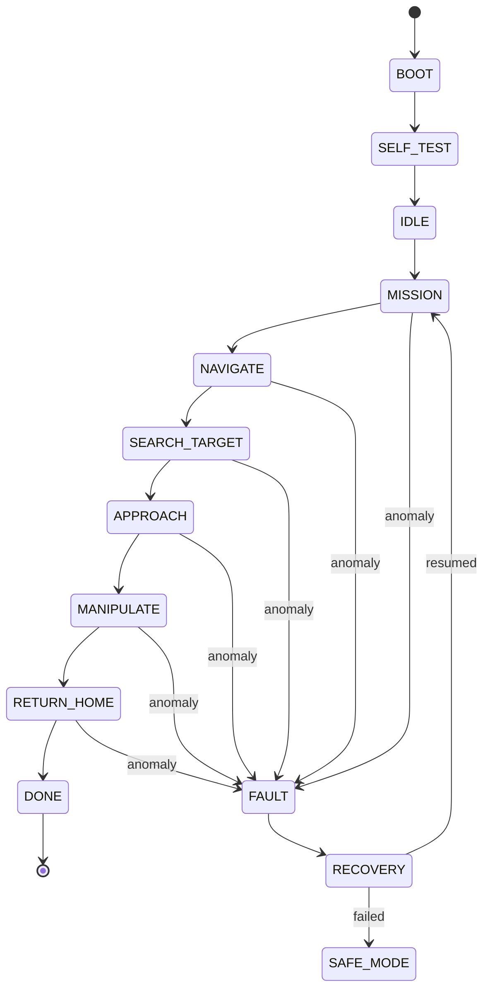

# 🚀🤖 Autonomous Rover — Onboard Navigation, Perception &amp; Fault Recovery

> An autonomous inspection rover on Raspberry Pi, engineered as a **mini systems engineering project**:  
> requirements → architecture → implementation → verification → fault injection → recovery.
>
> *Selected space software engineering practices inspired by ECSS, applied to a small autonomous robotic platform.*

## 🎯 Mission

A *planetary rover*–style inspection scenario, in a controlled, **deterministic** environment (fully reproducible runs):

1. Self-test at startup
2. Autonomous navigation to a zone of interest (obstacle avoidance)
3. Target detection and identification with the onboard camera
4. Approach / alignment, then arm action (touch, grasp, press)
5. Action verification, then `RETURN HOME`
6. Continuous anomaly monitoring → recovery, or `SAFE MODE` if the mission can no longer continue

## 🔀 State Machine

The backbone of the application: an **explicit** state machine, with a `FAULT → RECOVERY` transition reachable from any state.



On top of it, a **health hierarchy** managed by the Health Monitor:

`NOMINAL → DEGRADED → CRITICAL → SAFE`

## 🏗️ Architecture

```text
src/
├── mission/        # which activity to perform (Mission Manager)
├── navigation/     # where to go, how to avoid, when to stop
├── perception/     # image → target/obstacle → relative position
├── control/        # decision → motor commands (v, ω)
├── manipulation/   # arm action on the target
├── fdir/           # fault detection, isolation & recovery
├── safety/         # mechanisms that override the mission (safe mode, watchdog)
├── hardware/       # camera, motors, arm, sensors, battery
└── common/         # event logging, state transitions, utilities
```

Key separation: **decision (mission) / behavior (navigation, perception) / control**, with FDIR able to interrupt a nominal activity as soon as a critical condition is detected.

## 🔌 Hardware Abstraction

Mission logic never touches GPIO or the camera directly. It relies on a single interface:

```python
robot.move(v, omega)
robot.stop()
robot.get_camera_frame()
robot.get_battery()
robot.arm.move()
```

Two interchangeable implementations: `RealRobot` (Raspberry Pi) and `SimulatedRobot` — the same mission code runs on the real robot **or** in simulation, so you can test without risking the hardware.

> No ROS required: a modular Python architecture, designed to stay simple and verifiable.

## 🛡️ FDIR

- Continuous monitoring: battery, odometry, sensors, perception timeouts
- Health hierarchy: graceful degradation before safe mode
- Fault injection in tests (low battery, sensor loss, stalled motor)
- Full logging of events and state transitions

## ✅ Positioning

This is **not** ECSS-compliant space software — it is a project that **applies practices inspired by ECSS-E-ST-40** (requirements, design, V&amp;V, traceability) to a small autonomous robotic platform. The goal: demonstrate the *systems engineering* reasoning behind a real autonomous system.