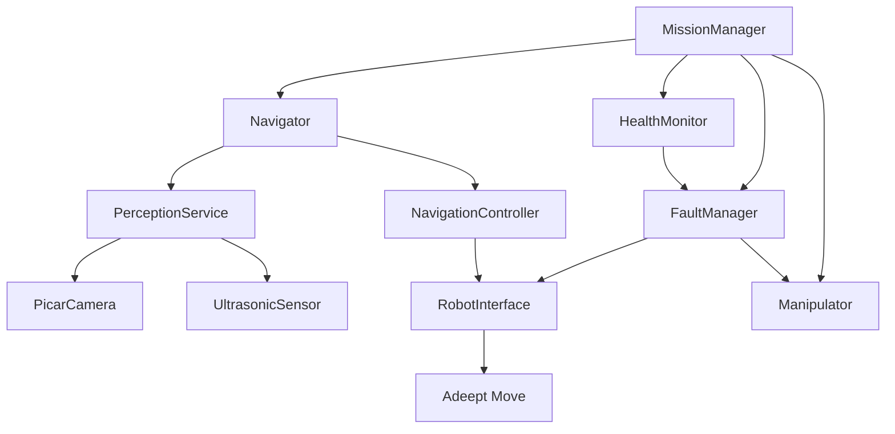

# Software Architecture

## Scope

The software uses selected systems-engineering practices for the Adeept PiCar Pro. Mission orchestration, perception, navigation, manipulation, fault handling, and hardware adapters are separate. This is not a safety-certified or real-time architecture.

## Components

`MissionManager` owns mission state, periodic health checks, recovery routing, outcomes, and return behavior. `Navigator` obtains camera and front-range data, asks `PerceptionService` for target and obstacle abstractions, and sends motion commands through `RobotInterface`. `NavigationController` implements reactive search, alignment, approach, and obstacle avoidance. `AdeeptManipulator` runs the timed arm/gripper sequence and a visual post-action check.

## Hardware Interfaces

| Interface | Adeept/local implementation | Observable data |
|---|---|---|
| Drive | `Move.move(speed, direction, turn, radius)` and `Move.motorStop()` | Commands only; no encoder or motor-current feedback |
| Camera | Local Picamera2 `PicarCamera` | Capture errors, frames, and frame-rate estimate |
| Front range | Adeept `Ultra.checkdist()`, converted from cm to m | One forward-facing reading, up to the driver's 2 m range |
| Arm/gripper | `RPIservo.ServoCtrl`, channels 2 and 4 | Driver-tracked commanded position, not physical feedback |
| Platform | Adeept `Info` functions | CPU use, RAM use, and CPU temperature |
| Battery | Optional `RealRobot` callback | No battery percentage source wired by default |

## Mission Flow

The mission progresses through `BOOT`, `SELF_TEST`, `IDLE`, navigation/search/approach, manipulation/verification, return, and `DONE`. Faults enter `FAULT` and `RECOVERY`, then resume the interrupted state, request return, or enter `SAFE_MODE`.

Return reverses recorded `(v, omega, duration)` segments. It is an open-loop approximation, not localization or a guarantee of reaching the start. The arm action is timed and assumes the expected kit configuration.

## Testability

Drive, camera, sensor, navigator, manipulator, logger, and clock can be replaced by fakes. Unit tests run without GPIO, Picamera2, or Adeept modules. Physical driver behavior and course performance require separate Raspberry Pi tests.